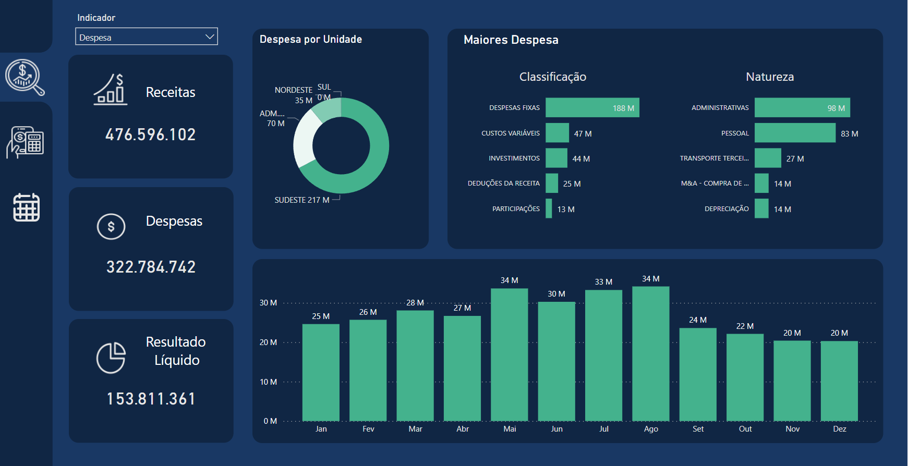
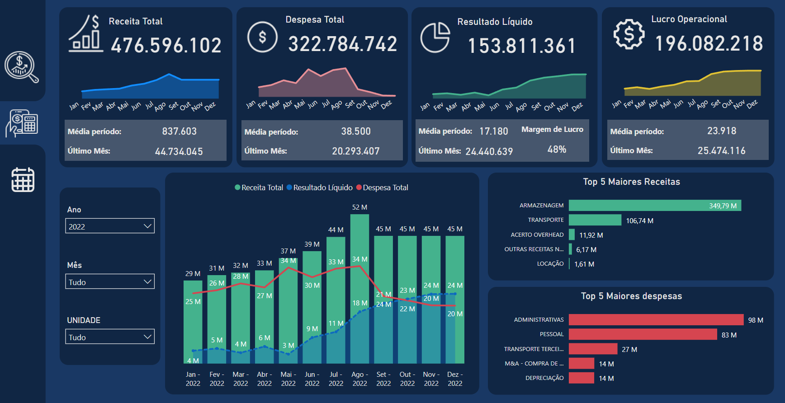
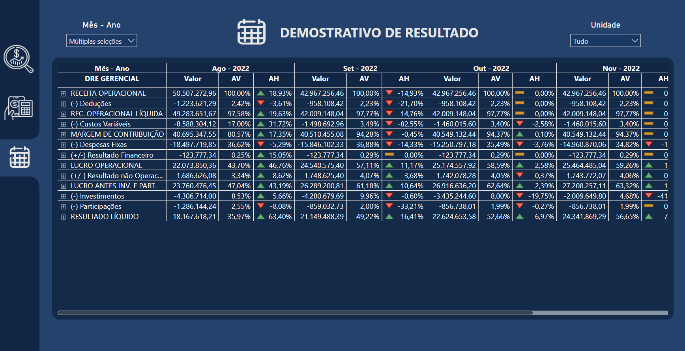
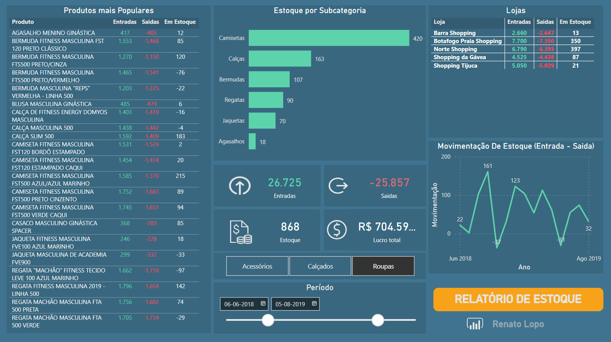

# Portfólio Power BI 📊

Dashboards elaborados com foco em estudos na ferramenta Power BI, visando construir um portfólio com cenários reais do dia a dia:
- [Dashboard Financeiro](./Financeiro/)
- [Simulador de Volume](./Simulador%20Vol/)
- [Dashboard Estoque](./Estoque/)

### Dashboard Financeiro
#### Sobre o Relatório
O relátorio completo pode ser visualizado por [aqui](https://app.powerbi.com/view?r=eyJrIjoiMjJjNzJlZmEtZmY0OS00NGE1LTkyZDAtZGIxNDM5ZDQ3M2EyIiwidCI6IjZiMjM0MmZhLTIzZWItNDc1OS04YjRkLWNkMTc4ODgyNzdhNSJ9). A Ideia desse relátorio e mostrar um cenário ficticio de alguns dados financeiro de uma empresa. O relatorio tem 3 paginas contendo resumo, resumo detalhado com fluxo de caixa e DRE.

> Essa é a página de resumo onde é possível ver os principais indicadores no lado esquerdo (Receitas, Despesas e Resultado Líquido). Na parte superior esquerda tem um filtro onde é possível escolher qual indicador aparece nos gráficos.

> Aqui temos os gráficos mais detalhados sobre os indicadores financeiros do cenário fictício.

> Por último temos um gráfico de DRE com análise horizontal e vertical.

#### Estrutura e Modelagem da base de dados

### Simulador de Volume
#### Sobre o Relatório
O relátorio completo pode ser visualizado por [aqui](https://app.powerbi.com/view?r=eyJrIjoiZGI0ZDU2YmQtNmQ4NS00ZjA5LWE4NGQtYzUzZTljYmU2NjNkIiwidCI6IjZiMjM0MmZhLTIzZWItNDc1OS04YjRkLWNkMTc4ODgyNzdhNSJ9).
Este relatório simula a quantidade de volume que poderia esta sendo vendido nas lojas se os produtos não estivessem em ruptura. O calculo de "Oportunidade de Vol" e feito usando 2 bases, uma de ruptura e outra de sellin, com essas bases e calculado a quantidade de lojas com ruptura e depois é multiplicado pelo Vol médio para chegar na Oportunidade de Vol. Todos os dados usado nesse relatório são dados fictícios.

> Essa página mostra um resumo geral de todas as métricas (Vol. Medio, Ruptura, Lojas c/Ruptura e Oportunidade de Vol). Além de 2 tabelas com essas métricas distribuídas por categoria de produto e na parte superior do relatório alguns filtros onde é possível fazer análises mais precisas para identificar quais produtos e lojas devem investir esforço para ter um Vol de venda maior.

> Aqui temos uma visão mais detalhada da nossa métrica  de oportunidade de Vol, utilizando de gráficos para facilitar a nossa visualização, onde podemos identificar as redes com maior oportunidades e seus respectivos produtos com o maior indicador, além de um gráfico onde e possivel ver o evolutivo.

> Esse gráfico mostra uma hierarquia onde e possível expandir desde a regional ate os produtos com uma visualização mais precisa de onde se tem as melhores oportunidade de Vol.

#### Estrutura e Modelagem da base de dados

### Dashboard Esoque
#### Sobre o Relatório
O relatório de estoque oferece uma visão abrangente e interativa do status atual dos produtos em estoque. O relatório permite que os usuários tomem decisões informadas sobre gerenciamento de estoque, planejamento de compras e otimização de recursos. Através de gráficos intuitivos e tabelas dinâmicas, o relatório proporciona insights valiosos para melhorar a eficiência operacional e a tomada de decisões estratégicas. O relátorio completo pode ser visualizado por [aqui](https://app.powerbi.com/view?r=eyJrIjoiMTEyNWRmOWYtYjM5YS00ZjdlLTk5NWEtMDlmZjFkMmRlZWUwIiwidCI6IjZiMjM0MmZhLTIzZWItNDc1OS04YjRkLWNkMTc4ODgyNzdhNSJ9).

##### Principais Indicadores:
- **Entradas:** Quantidade de Produtos que entraram em estoque no período.
- **Saídas:** Quantidade de produtos que saíram de estoque no período.
- **Estoque:** Quantidade de produtos em estoque no período.
- **Lucro Total:** Lucro obtido com os produtos que saíram de estoque no período.

#### Estrutura da base de dados

