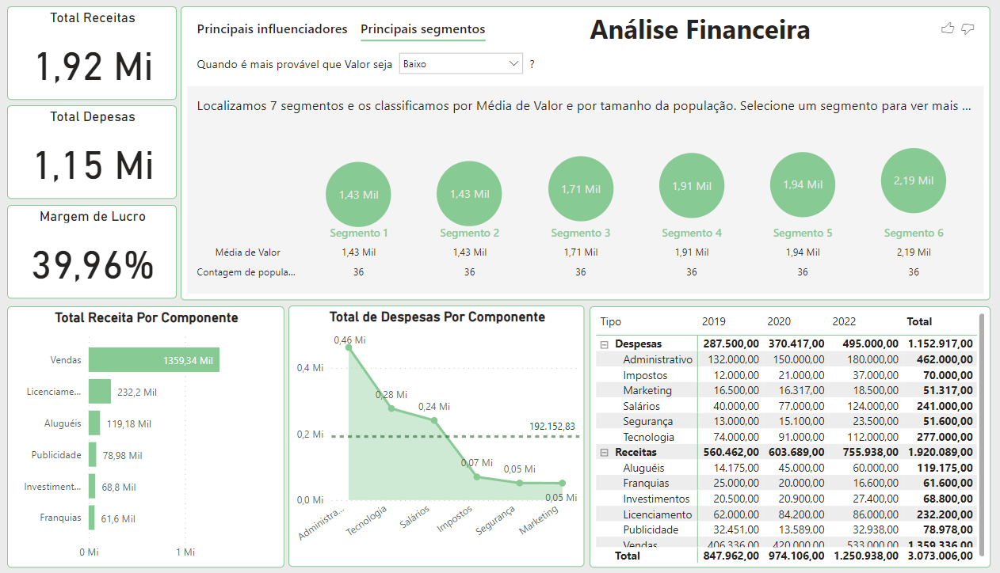

# Portfólio Power BI 📊

Dashboards elaborados com foco em estudos na ferramenta Power BI, visando construir um portfólio com cenários reais do dia a dia:
- [Simulador de Volume](./Simulador%20Vol/)
- [Dashboard Financeiro](./Financeiro/)
- [Dashboard DRE](./DRE/)
- [Dashboard Estoque](./Estoque/)
- [Dashboard Fluxo de Caixa](./Fluxo%20de%20Caixa/)

### Simulador de Volume
#### Sobre o Relatório
Este relatório simula a quantidade de volume que poderia esta sendo vendido nas lojas se os produtos não estivessem em ruptura. O calculo de "Oportunidade de Vol" e feito usando 2 bases, uma de ruptura e outra de sellin, com essas bases e calculado a quantidade de lojas com ruptura e depois é multiplicado pelo Vol médio para chegar na Oportunidade de Vol. Todos os dados usado nesse relatório são dados fictícios.

> Essa página mostra um resumo geral de todas as métricas (Vol. Medio, Ruptura, Lojas c/Ruptura e Oportunidade de Vol). Além de 2 tabelas com essas métricas distribuídas por categoria de produto e na parte superior do relatório alguns filtros onde é possível fazer análises mais precisas para identificar quais produtos e lojas devem investir esforço para ter um Vol de venda maior.

> Aqui temos uma visão mais detalhada da nossa métrica  de oportunidade de Vol, utilizando de gráficos para facilitar a nossa visualização, onde podemos identificar as redes com maior oportunidades e seus respectivos produtos com o maior indicador, além de um gráfico onde e possivel ver o evolutivo.

> Esse gráfico mostra uma hierarquia onde e possível expandir desde a regional ate os produtos com uma visualização mais precisa de onde se tem as melhores oportunidade de Vol.

#### Estrutura e Modelagem da base de dados

### Dashboard Financeiro
#### Sobre o Relatório
A Ideia desse relátorio e mostrar um cenário ficticio de alguns dados financeiro de uma empresa, bem resumido. 

> Os principais indicadores nesse relatório são: 
> * Margem de lucro: é a porcentagem de lucro que a empresa ganha em cada venda. Ela pode ser calculada dividindo o lucro líquido pela receita total.
> * Fluxo de caixa: é uma medida do dinheiro que entra e sai da empresa em um determinado período de tempo. Pode ser visto na tabela no canto inferior direito.
> * Total Despesas/Receita: Podem ser vista tanto o total geral, quanto por componentes

### Dashboard DRE
#### Sobre o Relatório
Este relatório em Power BI apresenta uma análise clara e concisa da Demonstração do Resultado do Exercício (DRE) de uma empresa fictícia . A DRE é uma ferramenta fundamental para avaliar o desempenho financeiro ao mostrar as receitas, custos e despesas, resultando no lucro líquido ou prejuízo ao final de um período.

##### Principais Indicadores:
***Receita Bruta:***
A Receita Bruta representa o montante total de vendas ou receitas geradas pela empresa antes de qualquer dedução, como impostos, devoluções ou descontos. Essa métrica reflete o volume total de negócios realizados pela empresa ao longo do período.

***Receita Líquida:***
A Receita Líquida é obtida subtraindo-se das Receitas Brutas os descontos, devoluções e impostos incidentes sobre as vendas. É a quantia de dinheiro efetivamente recebida pela empresa após considerar essas deduções, e representa a receita real disponível para as operações da empresa.

***Lucro Bruto:***
O Lucro Bruto é calculado subtraindo os Custos dos Produtos/Serviços Vendidos da Receita Líquida. Ele mostra quanto dinheiro a empresa está gerando após deduzir diretamente os custos associados à produção dos bens ou serviços vendidos. O Lucro Bruto é um indicador da eficiência na produção e das margens de lucro iniciais.

***EBITDA (Lucro Antes de Juros, Impostos, Depreciação e Amortização):***
O EBITDA é uma métrica que avalia o desempenho operacional da empresa, excluindo os efeitos de juros, impostos, depreciação e amortização. Ele oferece uma visão do resultado operacional bruto, antes de considerar elementos não operacionais e o impacto de ativos depreciados ou amortizados.

***Lucro Operacional:***
O Lucro Operacional é obtido subtraindo as Despesas Operacionais do Lucro Bruto ou do EBITDA, dependendo de como é calculado. Representa o resultado financeiro resultante das atividades principais de negócios da empresa, excluindo encargos financeiros e impostos.

***Lucro Líquido:***
O Lucro Líquido é o resultado final da DRE e representa o montante de lucro ou prejuízo obtido pela empresa após considerar todas as receitas, custos, despesas, impostos e encargos financeiros. É a métrica que reflete o desempenho global e a rentabilidade da empresa durante o período.

#### Estrutura da base de dados

Arquivo em excel que contém inicialmente as seguintes colunas:
> * Tabela DRE:
>> - Cod.DRE
>> - Descrição
>> - Operação
>> - Tipo

> * Tabela Lançamentos:
>> - Cod.ContaContabil
>> - Data
>> - Valor

> * Tabela MapaDRE:
>> - Cod.ContaContabil
>> - Cod.DRE

> * Tabela PlanoContas:
>> - Categoria
>> - Cod.Categoria
>> - Cod.ContaContabil
>> - Cod.Subcategoria
>> - ContaContábil
>> - Subcategoria

### Dashboard Esoque
#### Sobre o Relatório
O relatório de estoque oferece uma visão abrangente e interativa do status atual dos produtos em estoque. O relatório permite que os usuários tomem decisões informadas sobre gerenciamento de estoque, planejamento de compras e otimização de recursos. Através de gráficos intuitivos e tabelas dinâmicas, o relatório proporciona insights valiosos para melhorar a eficiência operacional e a tomada de decisões estratégicas.

##### Principais Indicadores:
***Entradas*** Quantidade de Produtos que entraram em estoque no período.

***Saidas*** Quantidade de produtos que sairam de estoque no período.

***Estoque*** Quantidade de produtos em estoque no período.

***Lucro Total*** Lucro obtido com os produtos que sairam de estoque no periodo.

***% Lucro Total*** % que cada produto ou loja representa do lucro total, afim de identificar quais produtos são mais valiosos para empresa.

#### Estrutura da base de dados

### Dashboard Fluxo de Caixa

#### Sobre o Relatório
Este relatório em Power BI oferece uma análise abrangente do fluxo de caixa, fornecendo insights valiosos sobre a saúde financeira de uma organização. O relatório destaca as principais informações financeiras, permitindo uma compreensão clara das entradas e saídas de dinheiro ao longo de um determinado período.

##### Principais Indicadores:
* ***Total de Entradas:*** Exibe a soma de todas as receitas e entradas de dinheiro durante o período selecionado. Isso inclui vendas, recebimentos de clientes e outras fontes de receita.

* ***Total de Saídas:*** Mostra o montante total gasto pela empresa, abrangendo despesas operacionais, pagamentos a fornecedores, despesas com pessoal e outros custos.

* ***Saldo Operacional:*** Calcula a diferença entre as entradas e saídas, oferecendo uma visão geral da lucratividade operacional. Um saldo positivo indica um resultado operacional saudável.

* ***Saldo Inicial:*** Representa o saldo de caixa no início do período analisado. É uma referência crucial para compreender como o fluxo de caixa evoluiu ao longo do tempo.

* ***Saldo Final:*** Mostra o saldo de caixa no final do período. Esse valor é o resultado líquido das atividades de entrada e saída de dinheiro durante o período.

#### Estrutura da base de dados

Arquivo em excel que contém inicialmente as seguintes colunas:
> * Tabela Fluxo:
>> - Cod.Mov
>> - Descrição

> * Tabela Movimentos:
>> - Categoria
>> - Cod.Mov
>> - Data
>> - Valor
